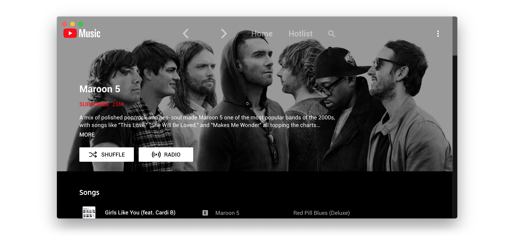

# YouTube Music

[](https://GitHub.com/th-ch/youtube-music/releases/)
[](https://github.com/th-ch/youtube-music/blob/master/LICENSE)
[](https://github.com/sindresorhus/xo)
[](https://ci.appveyor.com/project/th-ch/youtube-music)
[](https://travis-ci.org/th-ch/youtube-music)
[](https://snyk.io/test/github/th-ch/youtube-music)




**Electron wrapper around YouTube Music featuring:**

- Native look & feel, aims at keeping the original interface
- Framework for custom plugins: change YouTube Music to your needs (style, content, features), enable/disable plugins in one click

## Download

You can check out the [latest release](https://github.com/th-ch/youtube-music/releases/latest) to quickly find the latest version.

## Available plugins:

- **Ad Blocker**: block all ads and tracking out of the box
- **No Google Login**: remove Google login buttons and links from the interface
- **Shortcuts**: use your usual shortcuts (media keys, Ctrl/CMD + F…) to control YouTube Music
- **Navigation**: next/back navigation arrows directly integrated in the interface, like in your favorite browser
- **Auto confirm when paused**: when the "Continue Watching?" modal appears, automatically click "Yes"

## Dev

```sh
git clone https://github.com/th-ch/youtube-music
cd youtube-music
yarn
yarn start
```

## Build your own plugins

Using plugins, you can:

- manipulate the app - the `BrowserWindow` from electron is passed to the plugin handler
- change the front by manipulating the HTML/CSS

### Creating a plugin

Create a folder in `plugins/YOUR-PLUGIN-NAME`:

- if you need to manipulate the BrowserWindow, create a file `back.js` with the following template:

```node
module.exports = win => {
	// win is the BrowserWindow object
};
```

- if you need to change the front, create a file `front.js` with the following template:

```node
module.exports = () => {
	// This function will be called as a preload script
	// So you can use front features like `document.querySelector`
};
```

### Common use cases

- injecting custom CSS: create a `style.css` file in the same folder then:

```node
const path = require("path");
const { injectCSS } = require("../utils");

// back.js
module.exports = win => {
	injectCSS(win.webContents, path.join(__dirname, "style.css"));
};
```

- changing the HTML:

```node
// front.js
module.exports = () => {
	// Remove the login button
	document.querySelector(".sign-in-link.ytmusic-nav-bar").remove();
};
```

- communicating between the front and back: can be done using the ipcMain module from electron. See `utils.js` file and example in `navigation` plugin.

## Build

```sh
yarn build
```

Builds the app for macOS, Linux, and Windows, using [electron-builder](https://github.com/electron-userland/electron-builder).

## Tests

```sh
yarn test
```

Uses [Spectron](https://www.electronjs.org/spectron) to test the app.

## License

MIT © [th-ch](https://github.com/th-ch/youtube-music)
